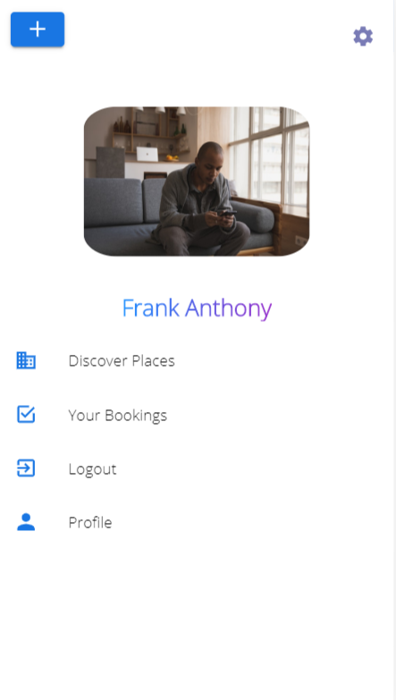

# Naiveo

Naiveo is a **Mobile Application** built using *Ionic 5*, *AngularJS*, *NodeJs* and *MongoDB*. It is a _simple_ and _fast_ app with _beautiful_, _user_friendly_ and _responsive layout_. I have independantly built this app with the purpose of connecting the tourists with the tour guides of the place that they are visiting such that the task of searching for a tour guide becomes not only **trouble-free** but also **swift and effortless**.

## Description

Naiveo allows one to create two kinds of accounts. One as a **Guide** and other as a **tourist**. The tour guides can create offers for providing tours of a particular place that are only valid for a specific period of time. The tourists can book these tours and have an **assisted**, **organized** and most importantly **informational** tour of the respective place.

Discover             |  Places             |  Bookable Places
:-------------------------:|:-------------------------:|:-------------------------:
  |    |  

### Ionic Framework

Ionic is an HTML5 mobile app development framework targeted at building hybrid mobile apps. Hybrid apps are essentially small websites running in a browser shell in an app that have access to the native platform layer. Hybrid apps have many benefits over pure native apps, specifically in terms of platform support, speed of development, and access to 3rd party code.

Think of Ionic as the front-end UI framework that handles all of the look and feel and UI interactions your app needs in order to be compelling. Kind of like “Bootstrap for Native,” but with support for a broad range of common native mobile components, slick animations, and beautiful design.

Since Ionic is an HTML5 framework, it needs a native wrapper like Cordova in order to run as a native app. In this project however **Capacitor** is used. Like Cordova, Capacitor also wraps the web app or containerizes the web app and provides consistent access to Native APIs for every platform that app runs on. Ionic apps use Capacitor much like Cordova to seamlessly run your app across a variety of platforms without platform-specific code. Therefore capacitor offers the same cross-platform benefits like Cordova but it provides a more modern approach to mobile application development with access to various native device features taking advantage of the latest Web APIs and native platform capabilities.


### Sign-in and Sign-up Page

Authentication and Authorization

To access the features of the app one will need to create an account. Effective measures have been taken to encrypt the user data like passwords. Only the authorized users will only be able to access the various features of this app.

Sign In             |  Sign Up             |  Login            |  Home
:-------------------------:|:-------------------------:|:-------------------------:|:-------------------------:
  |    |    |  

### Discover Page

This page shows the various places for which the offers have been made and the list of places that are bookable for a particular user based on a set of parameters. 

#### Place Detail and Reviews

On the discover page, we can view the details of a particular place for which the offer was created by a specific guide. Further the user can see the reviews for the place as well as the rating. The user can give his own review for the tour given by the guide for the particular place for which he created the offer.

Further the guide can delete their offer that was made if required. 

Place Detail              |  Place Detail              |  Place Delete              |  Reviews            |  Reviews
:-------------------------:|:-------------------------:|:-------------------------:|:-------------------------:|:-------------------------:
  |    |    |    |  

One can also edit their own review after it has been posted. Further if needed the review can also be deleted. Ofcourse only personal reviews can be deleted or edited.

Edit Review             |  Edit Review             |  Delete Review
:-------------------------:|:-------------------------:|:-------------------------:
  |    |  

#### Book Place

The user can make a booking for a particular offer as can be seen in the images below.

Book Place             |  Action Sheet             |  Enter Info.            |  Choose date for tour
:-------------------------:|:-------------------------:|:-------------------------:|:-------------------------:
  |    |    |  

All the bookings that are made are accessible through the side menu.

Side Menu              |  Side Menu Slide              |  Booked Places              |  Booked Places            |  Delete Booking
:-------------------------:|:-------------------------:|:-------------------------:|:-------------------------:|:-------------------------:
  |    |    |    |  

## Getting Started

These instructions will get you a copy of the project up and running on your local machine for development and testing purposes.

### Prerequisites

For running this project, make sure that the following things are installed.

* Ionic 5 - Install Ionic 5 on your system Access [here](https://ionicframework.com/docs/intro/cli)
* Angular - Install Angular in the system. One can read the installation or setup instructions from [here](https://angular.io/guide/setup-local)
* NodeJS - Install NodeJS on your system. Access [here](https://nodejs.org/en/)
* MongoDB - Install MongoDB as a backend database. Access [here](https://www.mongodb.com/download-center)

### Installing

Using the Web url, clone the project in your local machine. Open the project in any editor, for example Visual Studio Code and in the terminal run the command:

> npm install

This will install all the dependencies that are required by the project to run. Once they are installed follow the steps below to run the project in the development environment.

```
1. Open the command terminal in the directory of the project and run the command 'ionic serve' to start the front end ionic server.
2. Start your local mongodb database server. 
3. Open another command terminal in the project directory and run the command 'npm run server' to start the backend server and connect to the mongodb database.
4. Open the browser and open localhost:8100 to open the Ionic App.
```


## Built With

* NodeJS 
* MongoDB
* Angular
* Ionic 5

## Authors

* **Suyash Awasthi** - *Initial work* - [suyash2810](https://github.com/suyash2810)

## License